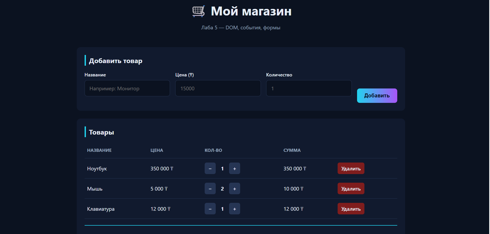

# dom-store-anarbaeva

**Тема:** Лаба 5 — DOM, события, формы. Интерактивный список товаров.
**Автор:** Анарбаева Акерке

## 🚀 Как открыть

Открыть `index.html` через **Live Server** (в VS Code: правой кнопкой по файлу → Open with Live Server).

## Что сделано

- Класс `Store` с приватным полем `#items`, методами `add`, `remove`, `updateQty`, `find` и геттерами `items` / `total`
- Рендер списка товаров в таблицу через DOM API
- Форма добавления с валидацией **в DOM** (ошибки показываются под полем, не через `alert`)
- Кнопки удаления и изменения количества (+, −)
- Живой total — пересчитывается при каждом изменении без перезагрузки

## Какие события я обработала и почему

Я обработала два основных события: `submit` на форме и `click` на списке товаров. Событие `submit` я использую, чтобы перехватить отправку формы и вызвать `preventDefault()` — так страница не перезагружается, а мы вручную валидируем поля и добавляем товар в Store.

Событие `click` я повесила **на весь список, а не на каждую кнопку** — это называется **делегирование событий**. Через `e.target.closest('button')` я нахожу нажатую кнопку, а через `closest('tr')` и `data-id` — строку и id товара. Такой подход работает даже для элементов, которые добавятся позже, и использует всего один слушатель вместо десятков.

## Делегирование событий

В `app.js` — один слушатель `listEl.addEventListener('click', ...)` обрабатывает **все три действия**: удалить, увеличить, уменьшить.

## Скриншот

## Инструменты ИИ

ChatGPT — для генерации структуры и объяснения делегирования событий.